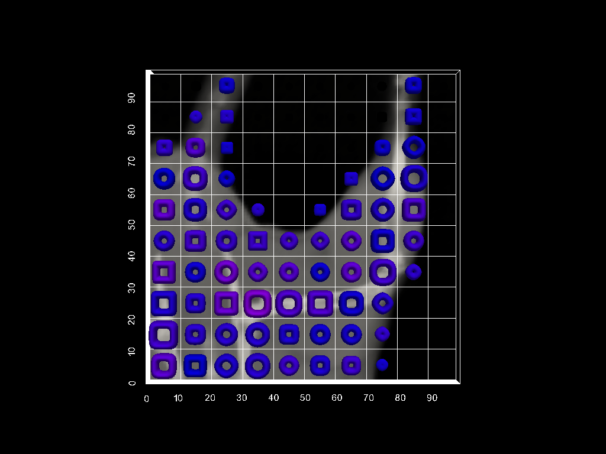

# Description of the project

This is the project page for testing VTK helper (vtki, [https://docs.vtki.org/](https://docs.vtki.org/)) to plot glyph images with parametric supertoroidal meshes.

Sample images are shown below:

Figure 1: Isometric view

Figure 2: XY view